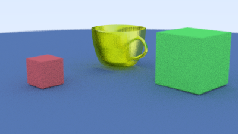
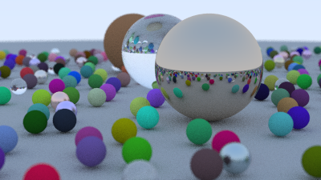

# Ray Tracing in Rust

This began as an implementation of the exercises in [Ray Tracing in One Weekend](
https://raytracing.github.io/books/RayTracingInOneWeekend.html) in Rust, but I've added my own extensions.

## STL models, cubes and K-d Trees
reading STL binary models, making cubes from triangles, using K-d Trees to accelerate ray-triangle interections within a mesh.

## Ray Tracing in One Weekend renders 

Non exhaustive list of other RTIOW implementations:

* https://github.com/fralken/ray-tracing-in-one-weekend
* https://github.com/perliedman/raytracing-in-one-weekend
* https://github.com/alexislozano/raytracing
* https://bitshifter.github.io/2018/04/29/rust-ray-tracer-in-one-weekend/
* https://misterdanb.github.io/raytracinginrust/